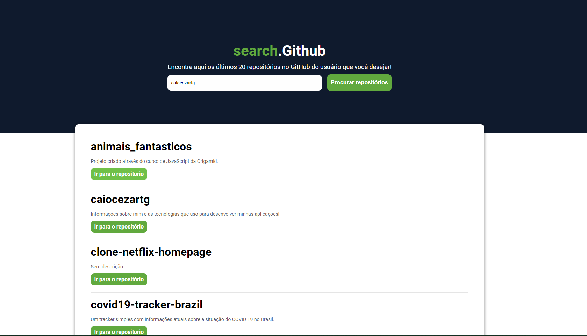

# search.Github

<!---Esses são exemplos. Veja https://shields.io para outras pessoas ou para personalizar este conjunto de escudos. Você pode querer incluir dependências, status do projeto e informações de licença aqui--->




> Precisando ver os repositórios de um usuário no GitHub de maneira mais prática? Conheça o search.Github! Basta apenas digitar o nome do usuário corretamente, clicar no botão e será listado 20 repositórios do usuário!

### Ajustes e melhorias

O projeto ainda está em desenvolvimento e as próximas atualizações serão voltadas nas seguintes tarefas:

- [x] Estilização dos repositórios
- [x] Alerta de erro quando o usuário digitar o nome errado
- [x] Layout totalmente responsivo


## 💻 Pré-requisitos

Antes de começar, verifique se você atendeu aos seguintes requisitos:
<!---Estes são apenas requisitos de exemplo. Adicionar, duplicar ou remover conforme necessário--->
* Você instalou a versão mais recente de `ReactJS, nodeJS`
* Você tem uma máquina `Windows, Linux ou Mac`.

## 🚀 Instalando search.Github

Para instalar o search.Github, siga estas etapas:

Linux e macOS:
```
cd searchgithub

npm install OU yarn
```

Windows:
```
cd searchgithub

npm install OU yarn
```

## ☕ Usando search.Github

Para usar search.Github, basta apenas:

```
Digitar o nome do usuário corretamente no campo de texto e apertar no botão de procura.
```

## 📫 Contribuindo para search.Github
<!---Se o seu README for longo ou se você tiver algum processo ou etapas específicas que deseja que os contribuidores sigam, considere a criação de um arquivo CONTRIBUTING.md separado--->
Para contribuir com <nome_do_projeto>, siga estas etapas:

1. Bifurque este repositório.
2. Crie um branch: `git checkout -b <nome_branch>`.
3. Faça suas alterações e confirme-as: `git commit -m '<mensagem_commit>'`
4. Envie para o branch original: `git push origin <nome_do_projeto> / <local>`
5. Crie a solicitação de pull.

Como alternativa, consulte a documentação do GitHub em [como criar uma solicitação pull](https://help.github.com/en/github/collaborating-with-issues-and-pull-requests/creating-a-pull-request).

## 😄 Seja um dos contribuidores<br>

Quer fazer parte desse projeto? Clique [AQUI](CONTRIBUTING.md) e leia como contribuir.

## 📝 Licença

Esse projeto está sob licença. Veja o arquivo [LICENÇA](LICENSE.md) para mais detalhes.

[⬆ Voltar ao topo](#search.Github)<br>
